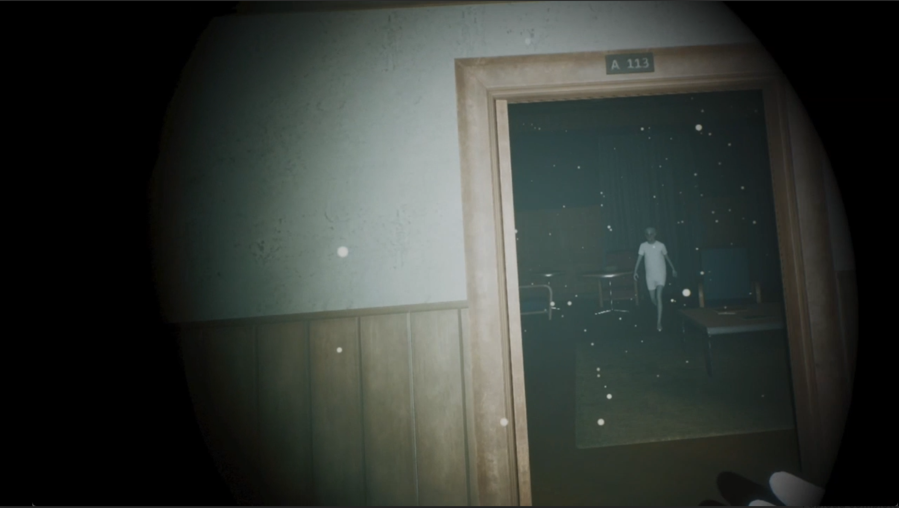
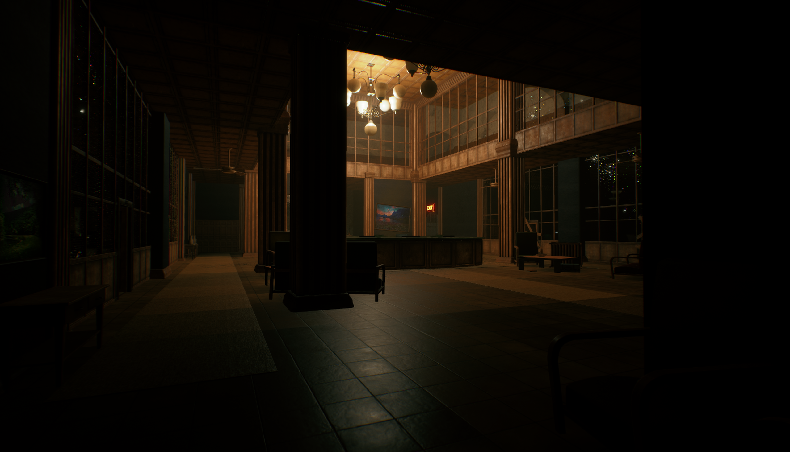
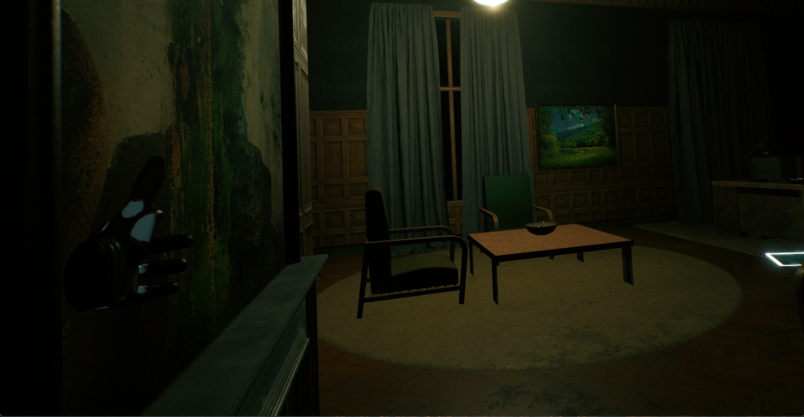
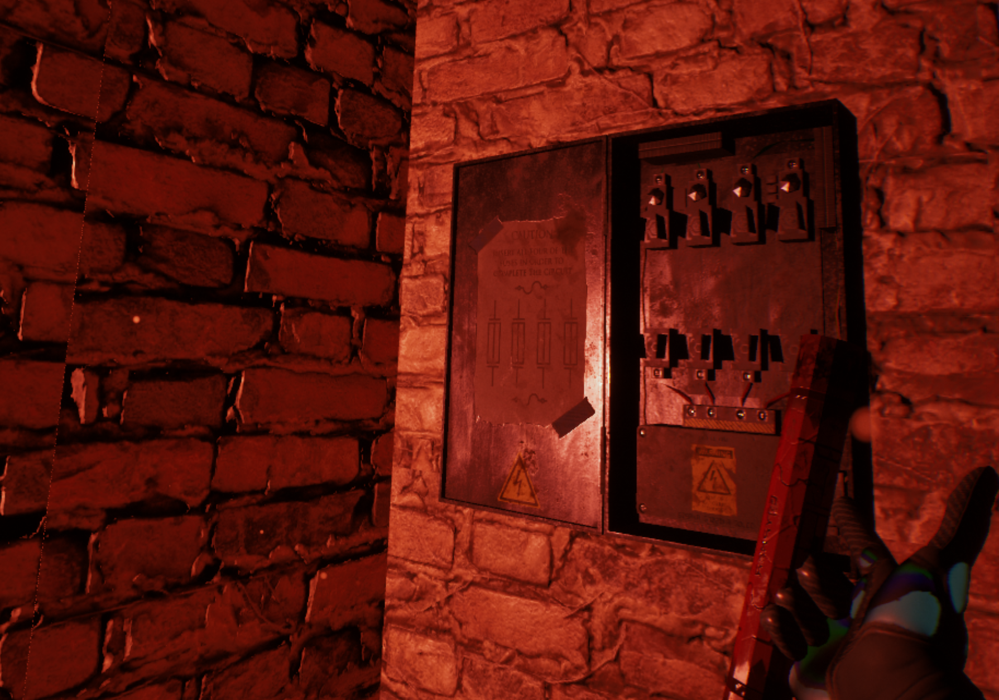
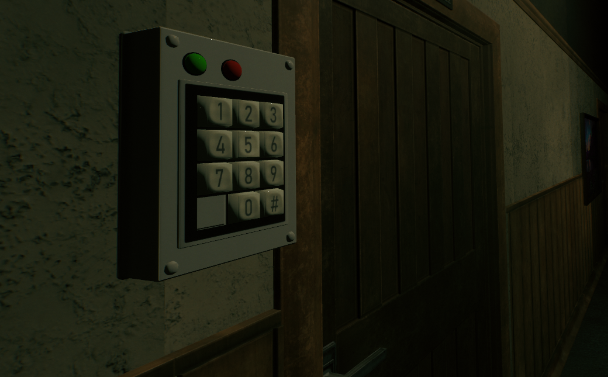
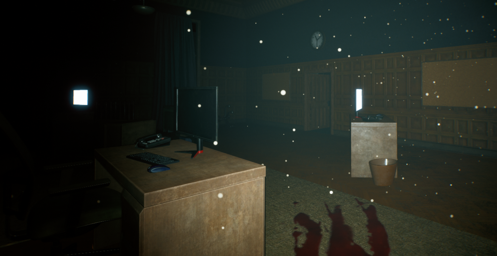

# Resilience Protocol
### A VR Stress Inoculation Simulation built in Unreal Engine 5.6

> You can't fight back. You can only survive.

Resilience Protocol is a first-person VR horror escape game designed as a **Stress Inoculation Training (SIT)** simulation. The player is trapped in an abandoned facility and must restore power, solve physics-based puzzles, and escape — all while being hunted by an autonomous AI enemy. The experience is designed so that genuine fear and psychological pressure are not side effects, but the point.

Built as a final project for **CSCI 5619: Virtual Reality and 3D Interaction** at the University of Minnesota.

---

## Demo

---

## Screenshots

<table>
  <tr>
    <td></td>
    <td></td>
  </tr>
  <tr>
    <td align="center"><em>Main atrium — baked lighting, abandoned atmosphere</em></td>
    <td align="center"><em>Interior room</em></td>
  </tr>
  <tr>
    <td></td>
    <td></td>
  </tr>
  <tr>
    <td align="center"><em>Stage 1 — physics-based fuse box puzzle</em></td>
    <td align="center"><em>Stage 2 — physical 3D keypad interaction</em></td>
  </tr>
  <tr>
    <td colspan="2"></td>
  </tr>
</table>

---

## How It Works

The simulation is structured as a linear escape room with three stages of escalating difficulty, based on the **graduated stress exposure** model from cognitive-behavioral research.

**Stage 1 — Restore Power**
The game begins in complete darkness. The player must scavenge for four colored fuses and physically insert them into a fuse box to restore power. Simple task. Hard to do when something is hunting you.

**Stage 2 — Bypass the Door**
A locked door blocks the exit. The code is hidden across several laptop screens scattered around the room. The keypad is a fully physical 3D object — the player physically taps the buttons with their index finger to enter the sequence.

**Stage 3 — Escape**
Four paintings on the wall must be rotated to match reference images found on nearby screens. The final exit only opens when all four are correct.

---

## Key Technical Systems

**The Stressor AI**
The enemy is built on a MetaHuman character to tap into the Uncanny Valley effect — a human face with no expression, sprinting at you in VR. It uses UE5's `PawnSensing` component with a 90° vision cone and a hearing threshold that responds to nearby physics noise. Patrol movement uses randomized Target Points so the pattern is never memorizable. On detection, a custom `Spot Player` event fires instantly — cancelling patrol, triggering a chase sound, and switching the AI to sprint speed.

**Physics-Based Interaction**
All puzzle interactions are physical. Fuses are grabbed and pushed into slots using collision-based snapping (`AttachActorToComponent` with Snap to Target). The keypad uses a `Sphere Collision` on the player's fingertip — pressing a button is a literal physical overlap event. No laser pointers, no UI menus.

**Optimization for VR**
The project targets stable 72 FPS on mobile VR hardware. Key decisions: Forward Shading over Deferred Rendering, MSAA 4x anti-aliasing, fully baked lighting via Lightmass, bulk UV generation to fix lightmap artifacts, and Merge Actors to reduce draw call count.

**Adaptive Audio**
Two music tracks — a low patrol drone and a high-tempo industrial chase beat — crossfade over 0.5 seconds when the AI switches states. Enemy footsteps use binaural spatial audio with distance attenuation, letting the player track the AI through walls by ear alone.

**Hybrid Locomotion**
Smooth joystick movement with a dynamic vignette system (custom material that darkens peripheral vision proportional to player speed), plus teleport as a fallback. Head-mounted flashlight attached to the VR camera rather than the hand — forces the player to physically turn and face what they want to see.

---

## Built With

| | |
|---|---|
| **Engine** | Unreal Engine 5.6 |
| **Characters** | MetaHuman Creator |
| **Scripting** | Blueprints |
| **AI** | PawnSensing, Behavior Trees |
| **Platform** | PC VR (Meta Quest 3 target) |
| **Rendering** | Forward Shading, MSAA 4x, Baked Lightmass |
| **Audio** | UE5 Spatial Audio, Attenuation, Sound Cues |

---

## Research Foundation

This project applies **Stress Inoculation Training (SIT)** methodology — a cognitive-behavioral approach that exposes individuals to controlled, graduated stress to build psychological resilience. The graduated three-stage structure draws from Finseth et al. (2021), who found that incremental stress exposure produces significantly better long-term resilience than skill-only training. The use of VR as the delivery medium is supported by Rizzo & Shilling (2017), who demonstrated that VR induces authentic physiological stress responses that standard screens cannot replicate.

---

## Limitations & Future Work

- AI uses a basic `MoveTo` command and does not search rooms or investigate hiding spots — a full Behavior Tree would address this
- Dynamic shadows are disabled to maintain frame rate; the flashlight does not cast real-time shadows from objects
- The experience is approximately 15–20 minutes — a full training tool would require multiple varied scenarios
- Future versions could integrate **biofeedback** (heart rate monitor) to dynamically adjust AI aggression based on the player's actual physiological stress level
- **Voice recognition** (microphone input triggering the AI) would add another layer of physical immersion

---

## Documentation

| Document | Link |
|---|---|
| 📄 Final Report | [docs/report.pdf](docs/report.pdf) |
| 📊 Presentation | [docs/presentation.pdf](docs/presentation.pdf) |

---

## About

**Ehtiram (Ezra) Shukurov** — MS Computer Science, University of Minnesota  
Research focus: VR, avatar realism, and psychophysical response in immersive environments  

[GitHub](https://github.com/Ehtiram-Shukurov) · [LinkedIn](https://linkedin.com/in/ehtiram-shukurov) · [Portfolio](https://your-portfolio-url.com)
